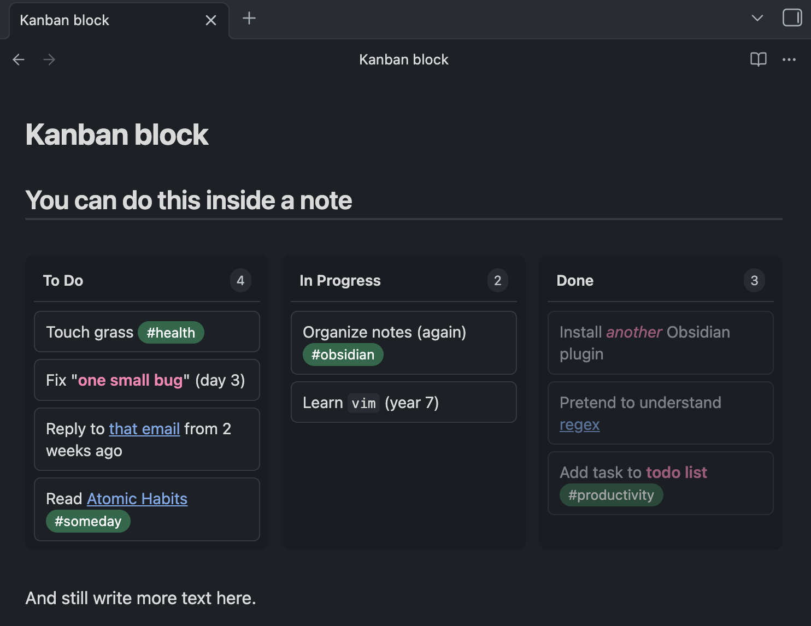

# Kanban Block

A simple Obsidian plugin that renders todo checkboxes as an interactive kanban board.

<video src="demo.webm" autoplay loop muted playsinline></video>

## Usage

Create a `todo` code block with checkbox items:

~~~markdown
```todo
- [ ] Touch grass #health
- [ ] Fix "**one small bug**" (day 3)
- [ ] Reply to [[That Important Email|that email]] from 2 weeks ago
- [ ] Read [[Books/Atomic Habits|Atomic Habits]] #someday
- [/] Organize notes (again) #obsidian
- [/] Learn `vim` (year 7)
- [x] Install *another* Obsidian plugin
- [x] Pretend to understand [[regex]]
- [x] Add task to **todo list** #productivity
```
~~~

This renders as a 3-column kanban board:



### Syntax

- `[ ]` → **To Do**
- `[/]` → **In Progress**
- `[x]` → **Done**

### Features

- Drag and drop between columns
- Reorder within columns
- Changes sync back to markdown in real-time
- Supports wiki links, bold, italic, code, and tags
- Nested items move with their parent (shown with `+N` badge)

## Manual Installation

1. Download `main.js`, `manifest.json`, and `styles.css` from the [latest release](https://github.com/ldomaradzki/obsidian-kanban-block/releases)
2. Create folder: `.obsidian/plugins/kanban-block/`
3. Copy the downloaded files into that folder
4. Reload Obsidian
5. Enable in Settings → Community Plugins

## Development

```bash
npm install
npm run dev    # Watch mode
npm run build  # Production build
```

## License

MIT
